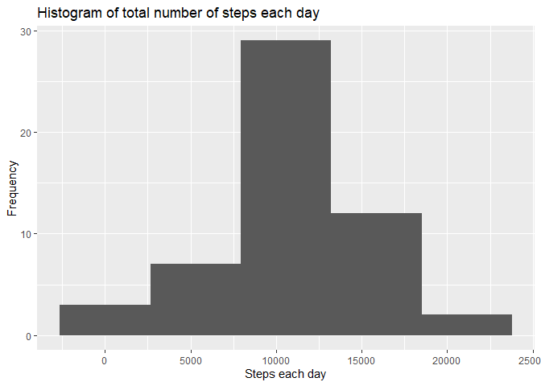
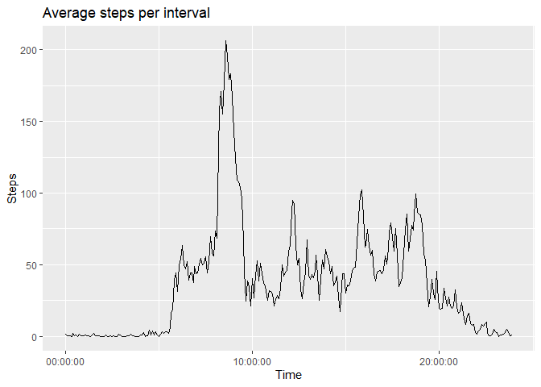
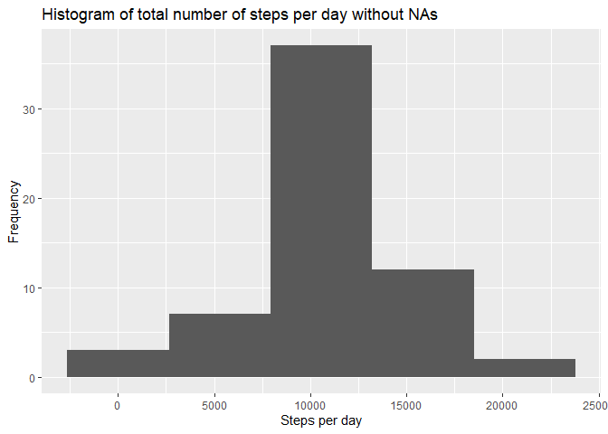
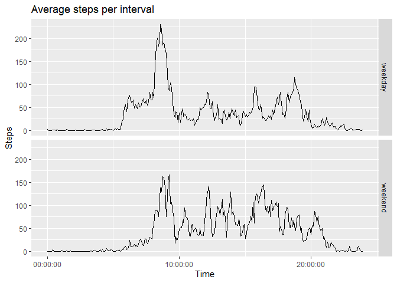

```r
# Load the required packages
library(knitr)
library(lubridate)
library(dplyr)
library(tidyr)
library(ggplot2)
library(stringi)
```

## Loading and preprocessing the data


```r
# Load the data and convert the date variable into date using lubridate
activity <- read.csv(unz('activity.zip', 'activity.csv'))
activity <- as_tibble(activity)
activity <- mutate(activity, date = ymd(date))
# Add a colon to separate the hour and minute in the interval variable
activity <- mutate(activity, interval = stri_sub_replace(interval, -2, -3, replacement = c(':')))
# In the interval column, add a 0 in front of some rows in order to parse this variable as time using the lubridate's function hm()
activity$interval[startsWith(activity$interval, ':')] <- paste0('0', activity$interval[startsWith(activity$interval, ':')])
```
## What is mean total number of steps taken per day?


```r
# Aggregate and sum the steps by date
steps_per_day <- aggregate(activity$steps, by = list(activity$date), FUN = sum)
# Calculate the mean and median steps per day omitting the NA's
mean_steps <- mean(steps_per_day$x, na.rm = TRUE)
median_steps <- median(steps_per_day$x, na.rm = TRUE)
# Plot the histogram of steps per day omitting the NA's
ggplot(steps_per_day, aes(x)) + geom_histogram(bins = 5, na.rm = TRUE) + labs(x = 'Steps each day', y = 'Frequency', title = 'Histogram of total number of steps each day')
```

<!-- -->

The mean steps per day is 10766.1886792 and the median steps per day is 10765.


## What is the average daily activity pattern?


```r
# Aggregate and calculate the mean of steps by interval, omitting NA's
mean_steps_per_interval <- aggregate(activity$steps, list(activity$interval), mean, na.rm = TRUE)
# Find the interval that contains the maximum number of steps and that value
max_step_interval <- mean_steps_per_interval$Group.1[which.max(mean_steps_per_interval$x)]
max_steps <- max(mean_steps_per_interval$x)
# Plot the time-series of average steps vs interval
ggplot(mean_steps_per_interval, aes(hm(Group.1), x)) + geom_line() + scale_x_time() + labs(title = 'Average steps per interval', x = 'Time', y = 'Steps')
```

<!-- -->

On average, the 5-minute interval which contains the maximum number of steps is 8:35 with 206.1698113 steps.


## Imputing missing values


```r
# Calculate the total number of missing values in the dataset
total_na <- sum(!complete.cases(activity))
# Fill in the missing values using the mean for each 5-minute interval and create a new dataset with this data
activity_filled <- transform(activity, steps = ave(steps, interval, FUN = function(x) replace(x, is.na(x), mean(x, na.rm = TRUE))))
# Using the filled dataset, aggregate and sum the steps by date
steps_per_day_filled <- aggregate(activity_filled$steps, by = list(activity_filled$date), FUN = sum)
# Calculate the mean and median steps per day
mean_steps_filled <- mean(steps_per_day_filled$x)
median_steps_filled <- median(steps_per_day_filled$x)
# Plot the histogram of steps per day withou NA's
ggplot(steps_per_day_filled, aes(x)) + geom_histogram(bins = 5) + labs(x = 'Steps per day', y = 'Frequency', title = 'Histogram of total number of steps per day without NAs')
```

<!-- -->

The total number of missing values is 2304. The method used for filling in all of the missing values is fill the mean for that 5-minute interval.

The mean steps per day without NAs is 10766.1886792 and the median steps per day without NAs is 10766.1886792.


## Are there differences in activity patterns between weekdays and weekends?


```r
# Create a new factor variable to the activity_filled dataset, with the levels 'weekday' and 'weekend'
activity_filled <- mutate(activity_filled, week = factor(ifelse(weekdays(activity_filled$date) %in% c('sábado', 'domingo'), 'weekend', 'weekday')))
# Aggregate and calculate the mean of steps by interval and week 
agg_week <- aggregate(steps~interval+week, activity_filled, mean)
# Plot a panel time-series of average steps across weekdays or weekend days vs interval
ggplot(agg_week, aes(hm(interval), steps)) + geom_line() + scale_x_time() + facet_grid(rows = vars(week)) + labs(title = 'Average steps per interval', x = 'Time', y = 'Steps')
```

<!-- -->


